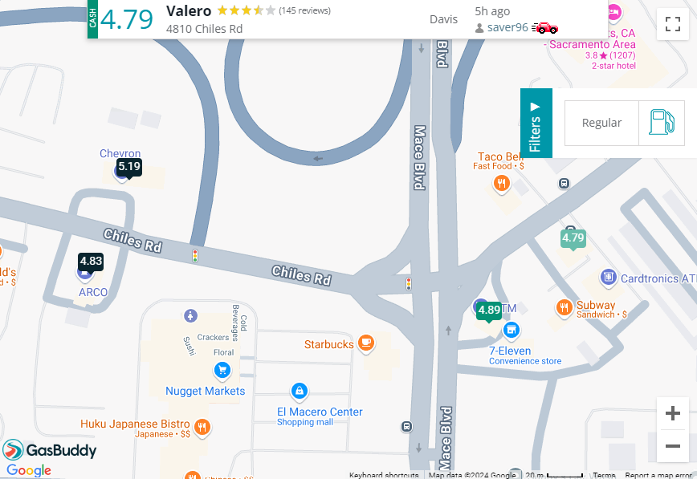

# Introduction

## Data Models
All data is an abstraction... a sample... a way of representing some aspect of the real world. We cannot capture everything. Data models are broad categories of file formats and encompass file formats that are structured in a similar way. You can think of these as themes in how data is structured.

With spatial data we typically divide data sets into two data models: Vector Data and Raster Data. We'll explore these in greater depth in this workshop.

## File Formats

A data model is related to the concept of a file format. Certain File Formats are used for specific data models, but each data model may be achieved with many different file types.  

For example, consider a nonspatial data model, the text document. This data model is a file containing text characters. You have a number of options for file formats when you save a text document, including a Word Document (.docx), text file (.txt), Google Doc, and Libre Office File. All of these file types store the same critical thing - text - but each may support additional features like text formatting or inclusion of images. Internally, they may store information in different ways, and each file format may differ in human readability (can you open the file with any text editor or do you need a specific program like Libre Office for it to work), but they all share a similar way of representing information - text.

Spatial data models are ways of abstracting the world and each has a set of File Formats associated with it. For example, Vector Data may be saved as a shapefile (.shp), geopackage (.gpkg), or as a comma separated variable (.csv), just to name a few.  We'll explore this in more detail later.

## Why?

Why do we need to know about different spatial data models and data formats? Can't our computers tell what the data is and handle it automatically? 

When we **use** spatial data, we need to know what format it is so we can make good decisions about how to analyze it efficiently. Knowing the format gives us intuition about how we can work with the data inside any given file.

When we **make** spatial data, we need to choose a format that will represent the real world with the highest degree of accuracy.

## The Big Picture

Spatial Data is usually composed of two parts:

1. Location = Where
2. Attributes = Information about the locations

You're probably already familiar with the idea of locations with attribute information from apps on your phone or other map-based information sources that are so common today. Let's take a look at an example of a website that helps users find gas stations, [GasBuddy](https://www.gasbuddy.com/):

Each location is indicated with a marker showing the price of gas, but you can also click on the marker to learn even more about the station - the name, address, rating, and when the price was last updated.

All spatial data uses this format - location + attribute information - but how the information is structured depends on the data model and the File Format you store the data in.

Let's dig into some more specifics of each data model!

<!--- VECTOR DATA --->
# Vector

## Exercise 

Draw a map on a piece of paper. It could be a map of how you got to this workshop, or how to get to your favorite hiking spot, or of all the mochi donut locations in downtown. The topic doesn't really matter. Just draw a map of your choosing.

How did you represent your data? Did you use lines and maybe squares or circles? When asked to draw a map on paper, people usually use the Vector data model to represent their ideas.

Why? Vector data is best for discrete objects.

## Description

Points, lines, polygons

Geometry + Attributes

## File Formats

Here are some common file formats you'll encounter when working with **vector** data:

| Name          | File Extension| Notes  |
| ------------- |:-------------:| ------:|
| Shapefile     | .shp (with .shx, .dbf, etc.) | Keep all the "sidecar" files together |
| Geopackage    | .gpkg         | Open format, easy organizing |
| Geojson       | .geojson      | Open format, human readable  |

<!--- RASTER DATA --->
# Raster

## Exercise 

Open an image or photo on your phone or computer. Zoom in really far. What do you see?

Image files are composed of a grid (imagine graph paper) where each square contains a color. When you zoom out, our brains interpret the image as objects, but it's really a bunch of colored squares. Squares next to each other might be similar in color, but contain small differences in shade or value. A square could contain virtually any color. (Technically, there are limits on the number of colors, but we're not going to get into that today.)

Most photographs you find will be formatted as Raster data.

Why? Raster data is best for gradients.

## Description

Grid - each cell contains one piece of information
Can have multiple layers (often called bands)

## File Formats

Here are some common file formats you'll encounter when working with **raster** data:

| Name          | File Extension| Notes  |
| ------------- |:-------------:| ------:|
| Geo TIFF      | .tiff or .tif |        |
|               |               |        |
|               |               |        |
|               |               |        |

<!--- CROSS-OVER DATA --->
# Cross-Over Data

## Vectors Representing Gradients

Topo lines, Isotherms, etc.

## Raster Representing Discrete Objects

Crop Type Maps, raster masks

<!--- OTHER DATA --->
# Other data models

## Point Cloud Data

= special instance of vector data

## Mesh Data

Here are some common file formats you'll encounter when working with **other** data models:

| Name          | File Extension| Notes  |
| ------------- |:-------------:| ------:|
|               |               |        |

<!--- Additional Resources --->
# Additional Resources

<!--- References --->
# References

<!--- KNITTING NOTES --->

<!---  Put this code in the TERMINAL window in R Studio:

cd C:/Users/mmtobias/Documents/GitHub/workshop_spatial_data_formats
./knit.R

--->