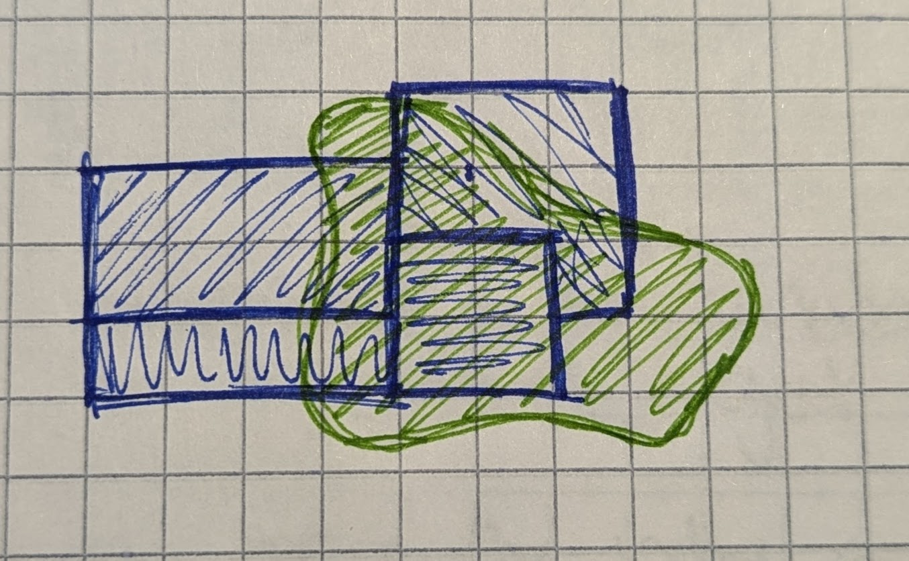
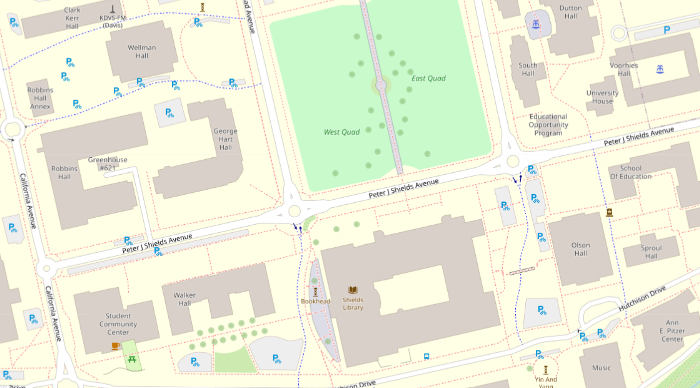
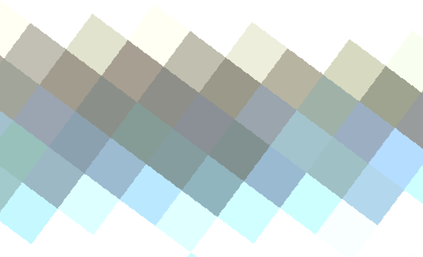
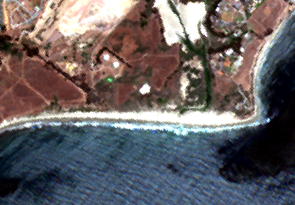
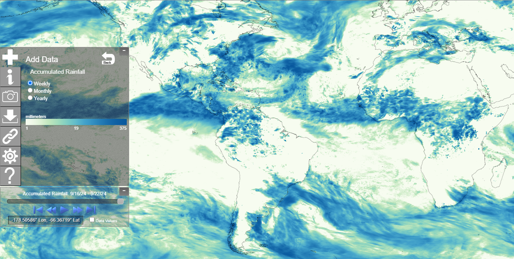
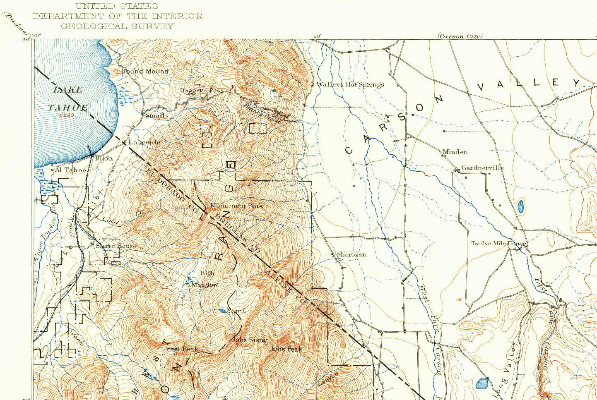
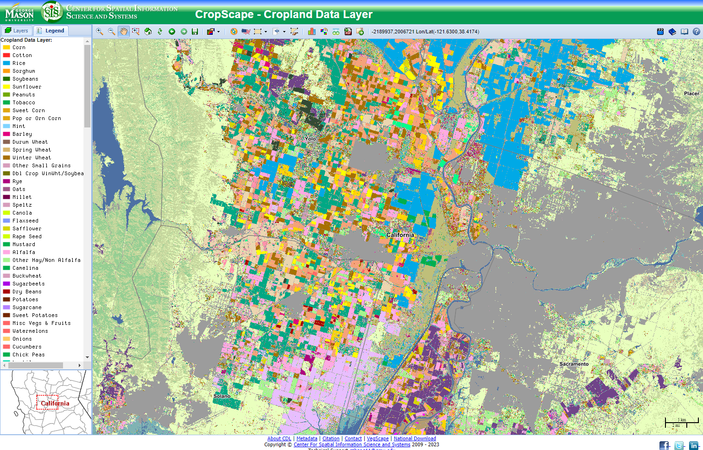

# Introduction

## Data Models
All data is an abstraction... a sample... a way of representing some aspect of the real world. We cannot capture everything. A data model is a way to conceptualize data. You can think of these as themes in how data is represented.

With spatial data we typically divide data sets into two data models: Vector Data and Raster Data. We'll explore these in greater depth in this workshop.

## File Formats

A data model is related to the concept of a file format. Every data model has at least one file format (and usually several file formats) to store data.

For example, consider a nonspatial data model, the text document. This data model is a file containing text characters. You have a number of options for file formats when you save a text document, including a Word Document (.docx), text file (.txt), Google Doc, and Libre Office File. All of these file types store the same critical thing - text - but each may support additional features like text formatting or inclusion of images. Internally, they may store information in different ways, and each file format may differ in human readability (Can you open the file with any text editor or do you need a specific program like Libre Office for it to work?), but they all share a similar way of representing information - text.

Spatial data models are ways of abstracting the world and each has a set of file formats associated with it. For example, vector data may be saved as a shapefile (.shp), geopackage (.gpkg), or as a comma separated variable (.csv), just to name a few.  We'll explore this in more detail later as well.

## Why?

Why do we need to know about different spatial data models and data formats? Can't our computers tell what the data is and handle it automatically? 

When we **use** spatial data, we need to know what model it uses so we can make good decisions about how to analyze it efficiently. Knowing the model and structure gives us intuition about how we can work with the data inside any given file.

When we **make** spatial data, we need to choose a model and file format that will represent the real world with the highest degree of accuracy.

## The Big Picture

Spatial Data is usually composed of two parts:

1. Geometry = The location of the data, where it is in space
2. Attributes = Information about the locations

*A quick note about the geometry: we are simplifying a bit here. Geometries not only contain locations but also require a coordinate reference system (also known as a projection). Data typically comes with a coordinate reference system already defined, so we'll deal with this concept another day. For  more on this topic, see DataLab's [Coordinate Reference Systems Workshop](https://ucdavisdatalab.github.io/workshop_coordinate_reference_systems/).*

You're probably already familiar with the idea of locations with attribute information from apps on your phone or other map-based information sources that are so common today. Let's take a look at an example of a website that helps users find gas stations, [GasBuddy](https://www.gasbuddy.com/):

*Above: Screenshot of GasBuddy showing 4 gas station locations with their prices*

Each gas station location is indicated with a marker showing the price of gas, but you can also click on the marker to learn even more about the station - the name, address, rating, and when the price was last updated.

All spatial data uses this format - location + attribute information - but how the information is structured depends on the data model and the file format you store the data in.

Let's dig into some more specifics of each data model!

<!--- VECTOR DATA --->
# Vector

## Exercise 

Draw a map on a piece of paper. It could be a map of how you got to this workshop, or how to get to your favorite hiking spot, or of all the mochi doughnut locations in downtown. The topic doesn't really matter. Just draw a map of your choosing.

*Above: a sketch of Census tracts overlayed with a travel time polygon.*

How did you represent your data? Did you use lines and maybe squares or circles? When asked to draw a map on paper, people usually use the *vector data model* to represent their ideas.

Why? Vector data is best for *discrete objects*. The prompt asked you to think about discrete things - buildings, routes, etc. - so you intuitively picked a data model that worked well for this kind of data.

## Description

**Geometry Representation:** Points, Lines, & Polygons

**Attributes Representation:** Tables

The geometry is usually visually represented as images (points, line, and polygons) but the data is actually stored numerically inside the file as a series of coordinate pairs. The data only covers the place where there is data, not the spaces in between the points, lines, or polygons. Compare this with Raster data in the upcoming sections.

The choice to represent your data as a point, line, or polygon depends on a couple of factors:

1. **The nature of the object in question.** Roads will almost always be lines.
1. **The scale of the map.** A city will be a polygon when you are zoomed in. But if you are mapping cities at the scale of the whole globe, points are probably a better choice.

### Examples

#### Picnic Day Fun

Let's take a made-up example scenario for consideration. Imagine you are working on a new City of Davis program promoting picnicking at local parks on Picnic Day. Your goal is to encourage people to get takeout from local restaurants and eat in a nearby green space.  To help people plan, you might make a map with the following vector datasets:

| Geometry          | Example| Attributes  |
| ------------- |:-------------:| ------:|
| Points    | Restaurants | name, region, price range |
| Lines    | Roads | name, speed limit, type |
| Polygons    | Parks | name, year opened, playground (Y/N) |

#### OpenStreetMap

Here is an example of real vector data in the [OpenStreetMap](https://www.openstreetmap.org/#map=18/38.540460/-121.749641) dataset:

*Above: A screen shot of OpenStreetMap showing the area of the UC Davis campus around the Quad.*

Notice how the larger areas (relative to the scale of the map) like buildings and green spaces are represented with polygons. Bike routes and pedestrian paths are lines. Smaller objects like fountains and sculptures are points represented with icons. You can see "Bookhead" on the west side of Shields Library, with an admittedly silly icon. Larger roads look like skinny polygons but are actually lines styled with a wide stroke.

## File Formats

Here are some common file formats you'll encounter when working with **vector** data:

| Name          | File Extension| Notes  |
| ------------- |:-------------:| ------:|
| Shapefile     | .shp (with .shx, .dbf, etc.) | Keep all the "sidecar" files together |
| Geopackage    | .gpkg         | Open format, easy organizing |
| Geojson       | .geojson      | Open format, human readable  |
| Google Keyhole Markup Language (KML) | .kml, .kmz | Google's spatial data format |
| GPS eXchange Format | .gpx | A common GPS file type |

<!--- RASTER DATA --->
# Raster

## Exercise 

Open an image or photo on your phone or computer. Zoom in really far. What do you see?

*Above: A very zoomed in image of a beach in a Sentinel 2 satellite image*

*Above: A zoomed-out image of the same beach in a Sentinel 2 satellite image*

Image files like your phone's camera produces are composed of a grid (imagine graph paper) where each square contains a color. When you zoom out, our brains interpret the image as objects, but it's really a bunch of colored squares. Squares next to each other might be similar in color, but contain small differences in shade or value. A square could contain virtually any color. (Technically, there are limits on the number of colors, but we're not going to get into that today.)

Most digital photographs you find will be formatted as Raster data.

Why? Raster data is best for gradients.

## Description

**Geometry Representation:** Grid

**Attributes Representation:** each cell contains one piece of information, represented as either discrete or continuous values

Coverage is continuous across the dataset, unlike vector data.

One piece of information can be stored in each layer or band. This is why it is common to have multiband images. For example, a "color" image is composed on 3 bands - the red, green, and blue components are stored in separate layers and combine by your image viewer software to make it look they way you'd expect.

Bands can also be used to represent different points in time. For example, you might have a raster file containing precipitation values with bands for ten different years.

## Examples

[NOAA's Climate Data Viewer](https://www.nnvl.noaa.gov/view/globaldata.html#RAIN) allows users to explore climate datasets online though an interactive web map. This tool loads raster datasets for various climate and weather measurements and stores each time period as a different band.

*Above: A screenshot of NOAA's Cliamte Data Mapper interactive online tool showing accumulated rainfall totals for 2024-09-16 through 2024-09-22. Darker blues are higher amounts of precipitation.*

The raster data model represents precipitation (or temperature, or elevation, etc.) well because the values we want to store are continuous and the coverage is also continuous.  Where I'm standing might have an inch of rain, but 100 feet away maybe recieved 1.1 inches, for example. And we are probably interested in the rainfall measurements everywhere, not just in discrete locations if we're tracking weather data.

## File Formats

Here are some common file formats you'll encounter when working with **raster** data:

| Name          | File Extension| Notes  |
| ------------- |:-------------:| ------:|
| Geo TIFF      | .tiff or .tif |        |
| geopackage    | .gpkg         | Yes, it stores both raster and vector data  |
| netCDF        | .nc           | Common in weather & climate data |
| Hierarchical Data Format (HDF)| .hdf5  | Common in weather & climate data |

<!--- CROSS-OVER DATA --->
# Cross-Over Data

Until now, we've considered our data models in a fairly narrow context - vector data is for discrete objects and raster data is for continuous measurements. But, there are times these rules don't fit our data or use case. Let's look at some cross-over data examples.

*Above: A grid comparing discrete vs. continuous data and raster vs. vector data representations of these two situations.*

## Vectors Representing Gradients

Sometimes it is easier to understand or work with continuous data if we group it into similar values. (People sometimes this process names like discretizing, binning, or chunking.) In a non-spatial context, we make histograms by counting the number of values that fall into "bins" of data to understand data distributions. When we use vector data to represent continuous data, we typically use lines to represent the boundaries between ranges of data values.

Common examples include topographic lines, isotherms (lines of equal temperature), or isochrones (lines of equal travel time). 

### Examples

#### Topographic Lines

Topographic ("topo" for short) lines show lines of equal elevation. Representing elevation in this way is efficient and, while not immediately intuitive to understand, a person can learn to interpret these kinds of maps with a little training.

*Above: A clip of the northwest corner of the 1889 USGS Markleeville, CA topo map (1:125000 scale)*

In this map, you can immediately see which parts of the landscape are steep and mountainous where the lines are close together because the elevation changes quickly (the west side of the map) and which parts are essentially flat (the east side) where the lines are far apart. Elevation values are communicated with labels and a key to tell you the increment for non-labeled lines (or you can count the unlabeled lines between the labeled ones and do a little math).

Explore more topo maps at the [USGS TopoView](https://ngmdb.usgs.gov/topoview/viewer) website. USGS has scanned most (if not all) of the topo maps made by the USGS and the site includes spatial data downloads for maps ranging from the 1800s to the present. 

## Raster Representing Discrete Objects

Sometimes it makes more sense to represent discrete objects in a raster. Masking raster layers to indicate areas to include and exclude from an analysis are common, as are crop type maps. Rasters can sometime store large datasets like crop cover more efficiently. Rasters may also be needed for specific types of analysis.

Scanned maps that represent features with points, lines, and polygons (like the USGS topo maps we looked above) are also technically raster data.

### Example

#### CropScape

It's fairly common to represent landcover with raster data. One reason for this is that the file size is smaller when you use raster data than vector data, given the complex nature of the boundaries between crop types. Another reason is that many land cover analyses use mostly raster datasets as inputs, so having this data produced and available as a raster dataset works well with the other data you might use for this kind of work.

The USDA National Agricultural Statistical Service (NASS) produces a raster dataset of crop cover for the US called CropScape. George Mason University's Center for Spatial Informationa Science and Systems displays this data on an [interactive webmap](https://nassgeodata.gmu.edu/CropScape/) that makes it easy to explore the dataset.

*Above: CropScape represents crop cover as raster data*

Zoomed out, it might looks like this data is vector data because individual fields tend to have one crop type so it looks like the fields are polygons. But zoom in, especially to an edge area, and you'll see the pixels.

<!--- OTHER DATA --->
# Other data models

## Point Cloud Data

Point cloud data is a special instance of vector data. Points represent the elevation at which a lidar beam intersects with an object to produce a high volume of points that can be used to construct elevation models or 3D models.

The [PDAL library](https://pdal.io/) (pronounced "pee-dahl" or "poodle") is a common tool for working with and visualizing this kind of data.

## Mesh Data

Mesh data combines features from raster and vector data. Coverage is continuous, like a raster, but cells can be shapes other than square, regular or irregular, because the geometry is a combination of points, lines, and polygons, called points, edges, and facets. The QGIS Documentation has an [in-depth explanation of mesh data](https://docs.qgis.org/3.34/en/docs/user_manual/working_with_mesh/mesh_properties.html).

### Triangular Irregular Network (TIN)

Triangular Irregular Networks (TIN) are useful to represent surfaces. The geometry, as the name implies, is a set of triangles that are any shape and size. Data you might see stored as a TIN includes slope, elevation, and aspect. 

### Hexagonal Grids

Hexagonal (Hex for short) Grids have cells that are hexagonal in shape instead of squares. Hex grids are common in movement analysis so you'll see them in the fields of transportation and animal ecology alike. The hexagonal shape gives each cell six neighbors instead of 4 with a square grid, making it easier to describe more natural movement situations. 

<!--- Additional Resources --->
# Additional Resources

## Workshops & Tutorials

[DataLab: Intro to GIS with QGIS](https://ucdavisdatalab.github.io/Intro-to-Desktop-GIS-with-QGIS/)

[DataLab: Cartography for Map Figures in Academic Journals & Books](https://github.com/MicheleTobias/Workshop-Cartography-Journal-Figures/blob/master/README.md)

[DataLab: Spatial SQL](https://ucdavisdatalab.github.io/Spatial_SQL/)

[GIS Geography: The Ultimate List of GIS Formats and Geospatial File Extensions](https://gisgeography.com/gis-formats/)

[NCAR Climate Data Guide: Common Climate Data Formats: Overview](https://climatedataguide.ucar.edu/climate-tools/common-climate-data-formats-overview)

[#maptimeDavis' Workshop Archive](https://maptimedavis.github.io/) - click Archive

## Software

[QGIS](https://qgis.org/) - free and open source desktop GIS with a graphical user interface

[ArcGIS Pro](https://servicehub.ucdavis.edu/servicehub?id=ucd_kb_article&sys_id=66e8687fdb0aeb006939fd831d961941) - proprietary desktop GIS with a graphical user interface; license fees are negotiated and paid for by the university for UC Davis campus affiliates

## Books

Bolstad, Paul, and Steven Manson. [*GIS Fundamentals: A First Text on Geographic Information Systems*](https://search.library.ucdavis.edu/permalink/01UCD_INST/9fle3i/alma991001527469303126). 7th edition., Eider Press, 2022.

<!--- Citations --->
# Citations

This workshop uses the following materials as reference:

Bolstad, Paul. 2019. [*GIS Fundamentals: a first text on geographic information systems*](https://search.library.ucdavis.edu/permalink/01UCD_INST/9fle3i/alma9981450459603126). 6th edition, XanEdu.

<!--- KNITTING NOTES --->

<!---  Put this code in the TERMINAL window in R Studio:

cd C:/Users/mmtobias/Documents/GitHub/workshop_spatial_data_formats
./knit.R --pdf

--->